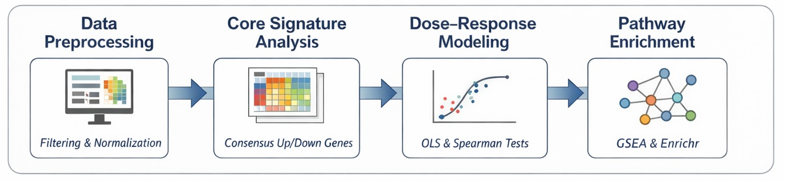

# Vitamin D Transcriptomic Profiling  
**A Data-Driven Analysis of Vitamin D–Induced Transcriptional Programs**

**Author:** Paula — Data Scientist / Computational Biology  
**Focus:** Transcriptomics · Bioinformatics · Data Science applied to biology

---

## Project Overview

This project explores the **transcriptional response to Vitamin D and related analogs** using publicly available data from the **LINCS L1000** consortium.  
The goal is to combine **biological reasoning** with **rigorous data science workflows** to characterize global and context-specific patterns of gene expression modulation.

Rather than treating this as a purely predictive task, the project emphasizes:

- Careful dataset curation  
- Transparent exploratory analysis  
- Hypothesis-driven modeling  
- Statistical interpretability  
- Reproducibility and methodological clarity  

The repository is structured as a **complete analytical pipeline**, moving from raw data filtering to statistical inference and biological interpretation.

---

## Scientific Motivation

Vitamin D plays a well-established role in transcriptional regulation, impacting processes such as proliferation, differentiation, metabolism, and stress responses.  
However, its **context-dependent effects**—across different cell types, doses, and analogs—remain complex and heterogeneous.

High-throughput perturbational datasets like LINCS L1000 provide an opportunity to:

- Quantify shared vs. context-specific transcriptional programs  
- Assess dose–response behavior at the transcriptomic level  
- Identify conserved biological pathways modulated by Vitamin D  

This project uses these data to address such questions in a structured, data-driven manner.

---

## Core Hypotheses

The analyses in this repository are guided by the following explicit hypotheses:

1. **Cellular context explains more transcriptomic variability than compound identity** within the Vitamin D perturbation family.
2. A **consensus core transcriptional signature** of Vitamin D activity can be identified across cell lines.
3. Activation of this core signature exhibits **dose-dependent and monotonic behavior** in most cellular contexts.
4. Vitamin D analogs induce both **conserved transcriptional programs** and **context-specific biological responses**.

These hypotheses are tested progressively throughout the pipeline.

---

## Dataset and Scope

- **Source:** LINCS L1000 (LINCS2020 release)
- **Compounds:** Vitamin D and related analogs (e.g., calcitriol, calcipotriol, paricalcitol, tacalcitol, seocalcitol)
- **Cell lines:** PC3, MCF7, A549, U2OS, HA1E
- **Exposure time:** 24 hours
- **Final dataset:** 258 high-quality transcriptional signatures  
- **Gene space:** 12,328 genes (z-score normalized, Level 5)

The dataset is intentionally curated to balance **biological relevance**, **experimental consistency**, and **statistical robustness**.

---

## Analytical Pipeline

The project is organized as a sequence of notebooks, each addressing a specific analytical stage.

### 1. Dataset Filtering and Subset Definition
**Notebook:** `01_filtering`  
Identification and curation of a biologically meaningful Vitamin D subset from the full LINCS dataset, with explicit quality-control criteria.

---

### 2. Exploratory Data Analysis
**Notebooks:**  
- `02_EDA`  
- `03_EDA_subset`

Initial exploration of metadata, expression distributions, dimensionality reduction (PCA, UMAP), clustering, and quality metrics to assess structure, variability, and experimental coverage.

---

### 3. Directed (Hypothesis-Driven) Analyses
**Notebook:** `04_directed_results`

Definition of a **consensus Vitamin D core gene signature**, dose–response analysis using multiple complementary approaches (Spearman, OLS-HC3, bootstrap), and pathway enrichment (GSEA, Reactome, Hallmark).

---

### 4. Global Machine Learning Baseline
**Notebook:** `05_ml_baseline_global`

Implementation of an **Elastic Net regression baseline** to quantify global predictive signal, establish a lower-bound benchmark, and assess whether linear structure captures meaningful variance.

---

### 5. Functional Context and Biological Interpretation
**Notebook:** `06_functional_context`

Synthesis of enrichment results into higher-level functional themes, distinguishing conserved transcriptional programs from context-specific responses.

---

### 6. Statistical Modeling of Core Response
**Notebook:** `07_statistical_modeling_core_score`

Formal statistical modeling of the Vitamin D core score as a response variable, focusing on effect sizes, hypothesis testing, robust inference, and contextual interpretation.

---

## Key Findings (High-Level)

Across the full pipeline, the analyses consistently show that:

- A **robust Vitamin D core transcriptional signature** can be defined across multiple cell lines.
- This core response exhibits **dose-dependent activation** in most contexts.
- **Cell line identity** contributes more strongly to transcriptomic variability than compound identity.
- Pathway enrichment reveals a mix of:
  - conserved programs (cell cycle, metabolism, stress response)
  - context-specific processes (DNA repair, chromatin remodeling, immune signaling)

These results are internally consistent across exploratory, statistical, and modeling approaches.

---

## What This Project Is *Not*

To avoid overinterpretation, it is important to clarify that this project does **not**:

- Claim causal mechanisms or therapeutic conclusions  
- Replace controlled experimental validation  
- Optimize models purely for predictive performance  
- Attempt exhaustive biological annotation of all signals  

Its purpose is **analytical characterization and hypothesis evaluation**, not clinical inference.

---

## Reproducibility and Design Principles

- Deterministic pipelines with fixed random seeds  
- Centralized configuration (`vitd_utils.config`)  
- No manual data manipulation outside documented steps  
- Clear separation between EDA, modeling, and interpretation  

All results can be regenerated end-to-end from the documented pipeline.

---

## Project Status

**Status:** Complete (v1)

The core analytical pipeline is complete and self-contained.  
Possible extensions include non-linear modeling, hierarchical/mixed-effects approaches, or integration with additional perturbation datasets.

---

## Final Notes

This repository is designed as both:

- a **technical portfolio project** demonstrating applied data science and bioinformatics skills, and  
- a **biologically grounded analytical study** built on real-world transcriptomic data.

Feedback, discussion, and extensions are welcome.
