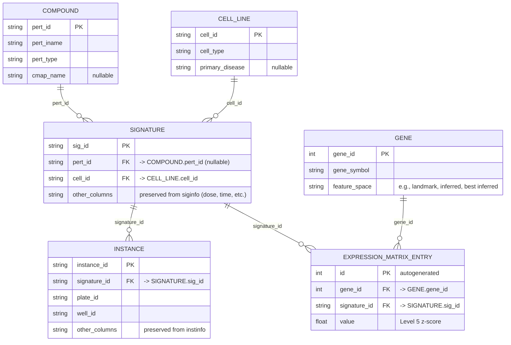
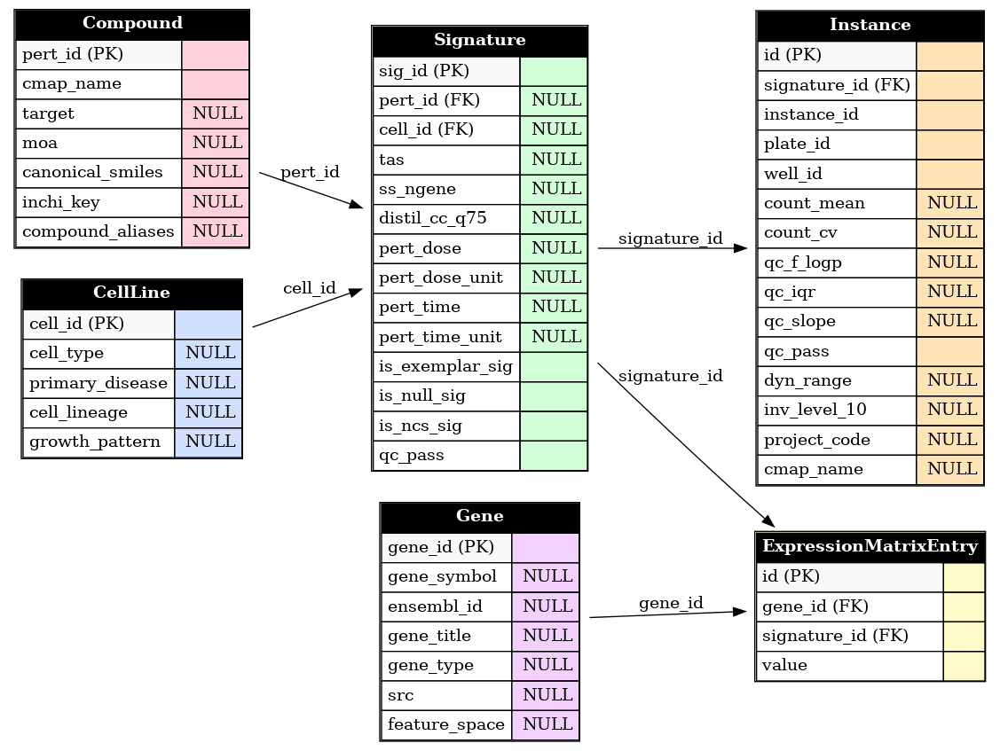

# Database Documentation (vitD-transcriptomic-profiling – Project Subset)

## Table of Contents
1. [Overview](#overview)
    - [Rationale for Full Metadata Loading](#rationale-for-full-metadata-loading)
    - [Scope and Subset](#scope-and-subset)
2. [Record Counts](#record-counts-current-build)
3. [Entity–Relationship Diagram (MER)](#entityrelationship-diagram-mer)
4. [Database Schema](#database-schema)
5. [Table-by-Table](#table-by-table)
    - [Compound](#compound)
    - [CellLine](#cellline)
    - [Gene](#gene)
    - [Signature](#signature)
    - [Instance](#instance)
    - [ExpressionMatrixEntry](#expressionmatrixentry)
6. [Data Sources](#data-sources)
7. [Technical Considerations](#technical-considerations)
8. [Typical Usage in This Project](#typical-usage-in-this-project)
9. [Example Queries (SQL)](#example-queries-sql)
10. [Django Models Snippet](#django-models-snippet)
11. [Django ORM Examples](#django-orm-examples)
12. [Reproducibility & Extensibility](#reproducibility--extensibility)
13. [Creating and Populating the Database](#creating-and-populating-the-database)

---

## Overview

- **Engine:** SQLite (`.sqlite3`)
- **Status:** ***Static*** (no automatic updates planned)
- **Design goal:** Provide a clean and queryable subset of LINCS L1000 that is **reusable** as a base for other perturbation analyses.
- **What’s fully loaded:** Core **metadata tables** (cell lines, compounds, genes, signatures, instances).
- **What’s partially loaded:** The **expression matrix** is loaded **only** for the signatures relevant to this project (vitamin D–related subset), derived from the Level 5 GCTX.

### Rationale for Full Metadata Loading
Even though this project focuses exclusively on vitamin D compounds, the database includes the complete set of cell lines, compounds, genes, and metadata from the LINCS L1000 dataset.  
This design decision was made to ensure **future reusability** — researchers can easily integrate other expression matrices (e.g., other compound families) without repopulating the core metadata tables.  
The only partial table is the expression matrix, which was loaded only for the subset relevant to this project.

### Scope and Subset
This database contains the **full set of metadata tables** from the LINCS L1000 dataset (cell lines, compounds, genes, signatures, and instances), but the **expression matrix** is intentionally limited to a **subset of signatures** relevant to this project.  
The subset was defined based on:
- **Compounds:** Seven vitamin D compounds and analogs identified as relevant to the research scope.
- **Cell lines:** The most represented cell lines within the vitamin D subset.
- **Treatment time:** Fixed at 24 hours to maximize comparability.

As a result, expression values are **available only for 258 signatures**, each with a complete profile for all 12,328 genes. All other signatures remain in the metadata tables but have no associated expression values in this build.


---

## Record Counts (current build)

- **CellLine:** 240  
- **Compound:** 34,419  
- **Signature:** 1,201,944  
- **Instance:** 3,011,573  
- **Gene:** 12,328  
- **ExpressionMatrixEntry:** 3,180,624  

**Sanity checks**
- Unique signatures in matrix: **258**  
- Genes: **12,328**  
- Expected entries: **3,180,624**  
- Actual entries: **3,180,624** → ✅  
- Instances without Signature: **0**  
- Expression entries without Gene/Signature: **0/0**  

---

## Entity–Relationship Diagram (MER)


## Database Schema

The following diagram summarizes the structure of the SQLite database, including tables, primary keys, and relationships.



*Figure: Entity–relationship diagram for the LINCS L1000 vitamin D subset database.*

---

## Table-by-Table

### `Compound`
- **Purpose:** Canonical registry of small molecules / compounds (LINCS “perts” of type `trt_cp` and others if present).
- **Key fields:**  
  - `pert_id` *(PK, str)* — LINCS compound ID  
  - `pert_iname` *(str)* — common/inventory name  
  - `pert_type` *(str)* — perturbation type (e.g., `trt_cp`)  
  - `cmap_name` *(str, nullable)* — CLUE/CMap display name if available
- **Source:** `raw_data/compoundinfo_beta.txt`
- **Relations:** Referenced by `Signature.pert_id` (nullable for antibody/biologics or unknown).
- **Indexes:** PK on `pert_id`. Recommended: index on `pert_iname` for search.

---

### `CellLine`
- **Purpose:** Cell line registry with broad phenotypic annotations.
- **Key fields:**  
  - `cell_id` *(PK, str)* — LINCS cell code (e.g., `MCF7`)  
  - `cell_type` *(str)* — normal/tumor/other  
  - `primary_disease` *(str, nullable)*
- **Source:** `raw_data/cellinfo_beta.txt`  
- **Relations:** Referenced by `Signature.cell_id`.
- **Indexes:** PK on `cell_id`.

---

### `Gene`
- **Purpose:** Gene index for the L1000 feature space.
- **Key fields:**  
  - `gene_id` *(PK, int)* — LINCS gene ID  
  - `gene_symbol` *(str)* — HGNC symbol  
  - `feature_space` *(str)* — one of `landmark`, `inferred`, `best inferred`
- **Source:** `raw_data/geneinfo_beta.txt`
- **Relations:** Referenced by `ExpressionMatrixEntry.gene_id`.
- **Indexes:** PK on `gene_id`. Recommended: index on `gene_symbol`.

---

### `Signature`
- **Purpose:** Aggregate response profile for a condition (cell × perturbation × dose × time × replicates collapsed).
- **Key fields:**  
  - `sig_id` *(PK, str)* — LINCS signature ID  
  - `pert_id` *(FK → `Compound.pert_id`, nullable)*  
  - `cell_id` *(FK → `CellLine.cell_id`)*  
  - Other metadata preserved from `siginfo_beta.txt` (e.g., perturbation dose/time, batch/replicate descriptors, QC scores)
- **Source:** `raw_data/siginfo_beta.txt`
- **Relations:**  
  - One-to-many with `Instance`  
  - One-to-many with `ExpressionMatrixEntry`
- **Indexes:** PK on `sig_id`. Recommended: index on (`pert_id`, `cell_id`).

---

### `Instance`
- **Purpose:** Well-level measurements contributing to a signature.
- **Key fields:**  
  - `instance_id` *(PK, str)* — unique well/run identifier  
  - `signature_id` *(FK → `Signature.sig_id`)*  
  - `plate_id` *(str)*  
  - `well_id` *(str)*  
  - Other metadata preserved from `instinfo_beta.txt`
- **Source:** `raw_data/instinfo_beta.txt`
- **Relations:** Many `Instance` → one `Signature`.
- **Indexes:** PK on `instance_id`. Recommended: index on `signature_id`.

---

### `ExpressionMatrixEntry`
- **Purpose:** Sparse representation of the Level 5 matrix values used in this project.
- **Key fields:**  
  - `id` *(PK, int)* — autoincrement  
  - `gene_id` *(FK → `Gene.gene_id`)*  
  - `signature_id` *(FK → `Signature.sig_id`)*  
  - `value` *(float)* — Level 5 z-score (MODZ)
- **Source:** `processed_data/level5_beta_trt_cp_filtered.csv` (derived from `level5_beta_trt_cp_n720216x12328.gctx`, 33 GB original; subset contains only the 258 signatures analyzed here).
- **Relations:** Many entries connect a given `Signature` to all 12,328 genes.
- **Indexes:** Foreign-key indexes on `gene_id` and `signature_id`. For heavy workloads, consider a composite index `(signature_id, gene_id)`.
- **Integrity:** No missing cells for the loaded signatures (full 12,328 genes per signature).

---

## Data Sources

- **Metadata (raw):**  
  - `raw_data/compoundinfo_beta.txt`,  
  - `raw_data/siginfo_beta.txt`,  
  - `raw_data/instinfo_beta.txt`,  
  - `raw_data/geneinfo_beta.txt`,  
  - `raw_data/cellinfo_beta.txt`  
  *(filenames preserved as downloaded; not renamed)*.

- **Expression (processed):** `processed_data/vitD_expression_matrix.csv`  
  Filtered extract from the original  
  `level5_beta_trt_cp_n720216x12328.gctx` (≈33 GB), containing only the signatures defined in [Scope and Subset](#scope-and-subset).  
  This subset includes **258 signatures**, each with a complete expression profile for all **12,328 genes**.

> The final file contains **258 signatures** matching these filters, each with complete expression profiles for all **12,328 genes**.

> **Naming policy:** Column names and data types are **preserved** from the original LINCS metadata, with **minimal cleaning** for format consistency. No feature engineering or derivations were introduced in this build.

---

## Technical Considerations

- **Constraints:** Primary keys and foreign keys as described. No composite unique constraints beyond primary keys.
- **Indexes:** Primary/foreign key indexes are present (Django adds FK indexes by default). For performance, consider:
  - `Signature (pert_id, cell_id)`
  - `Gene (gene_symbol)`
  - `ExpressionMatrixEntry (signature_id, gene_id)` (composite)
- **Limitations:**
  - Expression values are available **only** for the 258 signatures in [Scope and Subset](#scope-and-subset).
  - Other perturbation types may appear in metadata but lack expression values in this filtered matrix.
  - The database is **static**; any extension requires explicit ETL steps.
- **Portability:** Schema is RDBMS‑agnostic and can be migrated to PostgreSQL/MySQL via Django migrations.  
  *Note:* SQLite enforces FKs when `PRAGMA foreign_keys=ON` (enabled by Django). Minor differences in text collation/`LIKE` semantics may exist across backends.

---

## Typical Usage in This Project

- **EDA:** Retrieve cohorts by compound/cell line; compute per-gene distributions; QC by signature metadata; link instances for batch effects.  
- **Modeling:** Train predictive models on Level 5 values (e.g., classify compound analogs, dose/time decoding, cell-line specificity).

---

## Example Queries (SQL)

```sql
SELECT s.sig_id, s.pert_id, s.cell_id
FROM Signature s
WHERE s.pert_id = 'BRD-A66229260'
  AND s.cell_id = 'MCF7';
```

---

## Django Models Snippet

```python
class Compound(models.Model):
    pert_id = models.CharField(max_length=20, primary_key=True)
    pert_iname = models.CharField(max_length=100)
    pert_type = models.CharField(max_length=50)
    cmap_name = models.CharField(max_length=100, null=True, blank=True)

class CellLine(models.Model):
    cell_id = models.CharField(max_length=20, primary_key=True)
    cell_type = models.CharField(max_length=50)
    primary_disease = models.CharField(max_length=100, null=True, blank=True)

class Gene(models.Model):
    gene_id = models.IntegerField(primary_key=True)
    gene_symbol = models.CharField(max_length=50)
    feature_space = models.CharField(max_length=50)

class Signature(models.Model):
    sig_id = models.CharField(max_length=100, primary_key=True)
    pert = models.ForeignKey(Compound, null=True, on_delete=models.SET_NULL)
    cell = models.ForeignKey(CellLine, on_delete=models.CASCADE)

class Instance(models.Model):
    instance_id = models.CharField(max_length=100, primary_key=True)
    signature = models.ForeignKey(Signature, on_delete=models.CASCADE)
    plate_id = models.CharField(max_length=50)
    well_id = models.CharField(max_length=10)

class ExpressionMatrixEntry(models.Model):
    gene = models.ForeignKey(Gene, on_delete=models.CASCADE)
    signature = models.ForeignKey(Signature, on_delete=models.CASCADE)
    value = models.FloatField()
```

---

## Django ORM Examples

```python
# All calcitriol compounds
calcitriol_compounds = Compound.objects.filter(pert_iname__icontains="calcitriol")

# All signatures for a given cell line
mcf7_sigs = Signature.objects.filter(cell__cell_id="MCF7")

# Expression vector for a given signature
expr_vector = dict(ExpressionMatrixEntry.objects
                   .filter(signature__sig_id="SIG123")
                   .select_related("gene")
                   .values_list("gene__gene_symbol", "value"))
```

---

## Reproducibility & Extensibility
- **Extend with new compounds:**  
  If the corresponding `Signature`, `Instance`, `Compound`, `CellLine`, and `Gene` entries already exist in the database, load the new Level 5 values for those signatures and append them to `ExpressionMatrixEntry`.  
  Otherwise, populate the missing metadata tables first before adding expression data.
- **Migrate to other RDBMS:** Use Django migrations to replicate the schema in PostgreSQL/MySQL without structural changes.

---

## Creating and Populating the Database

When cloning this repository, the `backend/` folder is included with the complete Django project structure and all necessary configuration, but the database file (`db.sqlite3`) is excluded from version control due to its size (~2 GB).  
To work with the project locally, you must first **create an empty database** using Django migrations and then **populate it** with data from the provided `raw_data/` and `processed_data/` directories.

```bash
# 1) Create the empty database (tables) from migrations
cd backend
python manage.py migrate

# 2) Populate all tables (uses raw_data/ and processed_data/)
python manage.py populate_all

# 3) Validate the database (record counts and integrity checks)
python manage.py validate_db
```

If you prefer to populate tables individually (optional):

```bash
python manage.py populate_compound
python manage.py populate_cellline
python manage.py populate_gene
python manage.py populate_signature --chunksize 100000
python manage.py populate_instance --chunksize 100000
python manage.py populate_expressionmatrixentry --chunksize 200000
python manage.py validate_db
```
